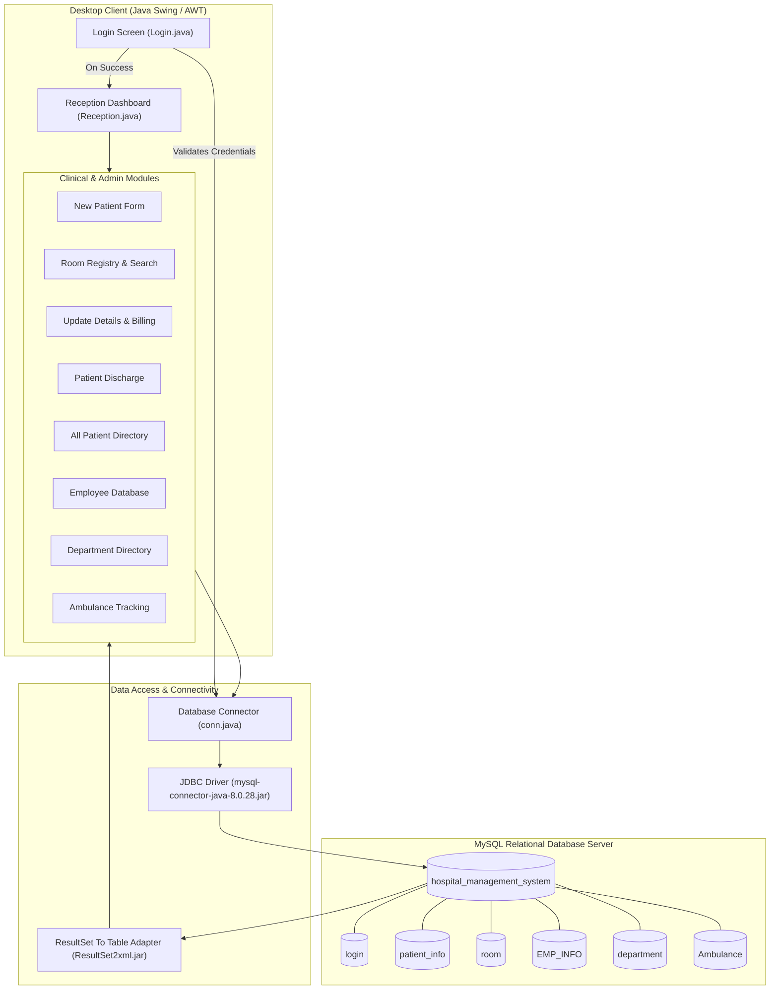
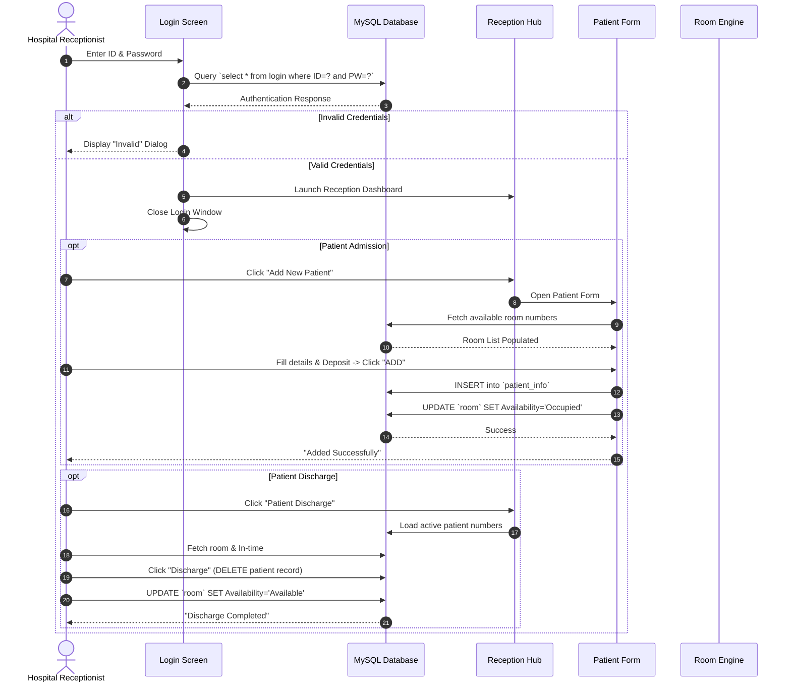

<div align="center">

# 🏥 Hospital Management System (HMS)

### *A Modern, Robust Desktop Healthcare & Administration Management Suite*

[](https://www.oracle.com/java/)
[](https://www.mysql.com/)
[](https://docs.oracle.com/javase/tutorial/uiswing/)
[](https://dev.mysql.com/downloads/connector/j/)
[](LICENSE)
[](#)

<br/>

<p align="center">
  <b>Hospital Management System (HMS)</b> is a comprehensive, feature-packed desktop software designed to automate and streamline core hospital workflows, including patient admissions, room allocations, real-time billing calculations, staff management, department phone directories, ambulance emergency dispatch, and patient discharges.
</p>

---

[Key Features](#-key-features) •
[System Architecture](#-system-architecture) •
[Database Schema & Setup](#-database-schema--sql-setup) •
[Quick Start & Installation](#-quick-start--installation) •
[Project Structure](#-project-structure) •
[Modules Overview](#-modules-overview) •
[Tech Stack](#-technology-stack)

---

</div>

<br/>

## 📌 Table of Contents

- [✨ Key Features](#-key-features)
- [🏗️ System Architecture](#-system-architecture)
- [🔄 Application Workflow](#-application-workflow)
- [💻 Modules Overview](#-modules-overview)
  - [1. Authentication & Security](#1-authentication--security)
  - [2. Central Reception Dashboard](#2-central-reception-dashboard)
  - [3. Patient Registration & Room Allocation](#3-patient-registration--room-allocation)
  - [4. Room Search & Availability Tracker](#4-room-search--availability-tracker)
  - [5. Patient Record & Real-Time Bill Calculation](#5-patient-record--real-time-bill-calculation)
  - [6. Patient Discharge & Auto-Vacate System](#6-patient-discharge--auto-vacate-system)
  - [7. Hospital Staff & Employee Directory](#7-hospital-staff--employee-directory)
  - [8. Department & Emergency Contact Registry](#8-department--emergency-contact-registry)
  - [9. Ambulance Emergency Dispatch Tracking](#9-ambulance-emergency-dispatch-tracking)
- [🛠️ Technology Stack](#️-technology-stack)
- [🗄️ Database Schema & SQL Setup](#️-database-schema--sql-setup)
- [🚀 Quick Start & Installation](#-quick-start--installation)
  - [Prerequisites](#prerequisites)
  - [Configuration](#configuration)
  - [Running the Project](#running-the-project)
- [📂 Project Structure](#-project-structure)
- [🎯 Future Enhancements](#-future-enhancements)
- [🤝 Contributing](#-contributing)
- [📄 License](#-license)

<br/>

---

## ✨ Key Features

| Category | Highlights |
| :--- | :--- |
| 🔐 **Authentication** | Secure credentials verification with instant access to the reception console. |
| 📝 **Patient Ingestion** | Dynamic ID proof selection (`Aadhar Card`, `Voter ID`, `Driving License`), timestamping, diagnosis records, and initial deposit tracking. |
| 🛏️ **Smart Room Allocation** | Real-time dropdown of active rooms with automatic status transition (`Available` ➔ `Occupied`). |
| 🔍 **Live Room Filtration** | Multi-criterion room search to quickly filter available beds vs. occupied beds with pricing. |
| 💰 **Automated Billing Computation** | Calculates pending balance automatically by deducting paid deposit from room price. |
| 🚪 **Automated Discharge** | One-click checkout that frees the allocated room back to `Available` and clears active admission entries. |
| 👨‍⚕️ **Staff Directory** | Centralized database of doctors, nurses, and hospital staff with contact, age, and compensation details. |
| 🚑 **Fleet Tracking** | Track ambulance readiness, assigned emergency driver, vehicle brand, and station location. |
| 📊 **Dynamic Data Grids** | Interactive tabular views powered by `rs2xml` / `DbUtils` for all hospital entities. |

<br/>

---

## 🏗️ System Architecture



<br/>

---

## 🔄 Application Workflow



<br/>

---

## 💻 Modules Overview

### 1. Authentication & Security
- **File:** `Login.java`
- **Functionality:** Authenticates authorized staff before granting access to medical and administrative records. Supports secure password masking (`JPasswordField`).

### 2. Central Reception Dashboard
- **File:** `Reception.java`
- **Functionality:** Serving as the central command center of HMS, this multi-button dashboard provides 1-click access to all hospital operations:
  - Add New Patient
  - Room Management
  - Department Directory
  - Employee Records
  - Patient Overview
  - Patient Discharge
  - Update Patient Details & Billing
  - Ambulance Services
  - Room Search
  - Secure Logout

### 3. Patient Registration & Room Allocation
- **File:** `NEW_PATIENT.java`
- **Functionality:** 
  - Captures national identity document type (Aadhar, Voter ID, Driving License) and ID number.
  - Records patient personal data, gender, and diagnosis/symptom details.
  - Dynamically queries available room numbers from MySQL.
  - Captures exact admission timestamp and initial cash deposit.
  - Atomically marks the assigned room as `Occupied`.

### 4. Room Search & Availability Tracker
- **Files:** `Room.java`, `Search_Room.java`
- **Functionality:** 
  - Comprehensive view of all rooms with room number, occupancy status, price, and bed type.
  - Dedicated search filter to instantly query rooms by status (`Available` vs `Occupied`).

### 5. Patient Record & Real-Time Bill Calculation
- **File:** `update_patient_details.java`
- **Functionality:**
  - Select any registered patient by name.
  - Automatically retrieves assigned room, admission time, and previous deposit.
  - Queries room pricing tariff and computes **Pending Balance (Rs)** in real-time (`Price - Deposit`).
  - Allows staff to update room allocation, time, and paid amounts seamlessly.

### 6. Patient Discharge & Auto-Vacate System
- **File:** `Patient_Discharge.java`
- **Functionality:**
  - Fast checkout process by patient ID number.
  - Compares original admission time with the current discharge timestamp.
  - Automatically removes discharged patient record and resets room status back to `Available`.

### 7. Hospital Staff & Employee Directory
- **File:** `Employee_info.java`
- **Functionality:** View complete list of hospital employees with name, age, salary, phone number, official email, and Aadhar identification.

### 8. Department & Emergency Contact Registry
- **File:** `Department.java`
- **Functionality:** Overview of hospital departments (e.g., Cardiology, Neurology, Orthopedics, Pediatrics, ER) with direct extension/phone lines.

### 9. Ambulance Emergency Dispatch Tracking
- **File:** `Ambulance.java`
- **Functionality:** Live tracking of all hospital ambulance vehicles, driver in charge, car model, availability status, and designated dispatch zones.

<br/>

---

## 🛠️ Technology Stack

| Layer | Component | Description |
| :--- | :--- | :--- |
| **Frontend UI** | `Java Swing` & `AWT` | Lightweight, native desktop UI components (`JFrame`, `JPanel`, `JTable`, `JComboBox`, `JButton`, `JLabel`, `ImageIcon`). |
| **Programming Language** | `Java (JDK 8 / 11+)` | Core Java OOP concepts, Event Listeners (`ActionListener`), Multi-window orchestration. |
| **Backend / Database** | `MySQL Server (8.0+)` | Relational database schema with relational integrity and queries. |
| **Database Connectivity** | `JDBC Driver` | `mysql-connector-java-8.0.28.jar` for high-throughput SQL communication. |
| **Data Binding Library** | `ResultSet2xml / DbUtils` | Converts SQL `ResultSet` directly into Swing `TableModel` for instant rendering. |
| **IDE Support** | `IntelliJ IDEA` / `Eclipse` / `NetBeans` | Pre-configured `.iml` and project definitions. |

<br/>

---

## 🗄️ Database Schema & SQL Setup

Run the following SQL script in your MySQL Workbench, phpMyAdmin, or MySQL CLI:

```sql
-- 1. Create the Database
CREATE DATABASE IF NOT EXISTS hospital_management_system;
USE hospital_management_system;

-- 2. Create Login Authentication Table
CREATE TABLE IF NOT EXISTS login (
    ID VARCHAR(50) NOT NULL PRIMARY KEY,
    PW VARCHAR(50) NOT NULL
);

-- 3. Create Patient Information Table
CREATE TABLE IF NOT EXISTS patient_info (
    ID_Type VARCHAR(50),
    number VARCHAR(50) PRIMARY KEY,
    Name VARCHAR(100),
    Gender VARCHAR(20),
    Patient_Disease VARCHAR(100),
    Room_Number VARCHAR(20),
    Time VARCHAR(100),
    Dposite VARCHAR(50)
);

-- 4. Create Room Management Table
CREATE TABLE IF NOT EXISTS room (
    room_no VARCHAR(20) PRIMARY KEY,
    Availability VARCHAR(50),
    Price VARCHAR(50),
    Room_Type VARCHAR(50)
);

-- 5. Create Employee Information Table
CREATE TABLE IF NOT EXISTS EMP_INFO (
    Name VARCHAR(100),
    Age VARCHAR(20),
    Salary VARCHAR(50),
    Phone_Number VARCHAR(50),
    Gmail VARCHAR(100),
    Aadhar_Number VARCHAR(50) PRIMARY KEY
);

-- 6. Create Department Directory Table
CREATE TABLE IF NOT EXISTS department (
    Department VARCHAR(100) PRIMARY KEY,
    Phone_Number VARCHAR(50)
);

-- 7. Create Ambulance Fleet Table
CREATE TABLE IF NOT EXISTS Ambulance (
    Name VARCHAR(100),
    Gender VARCHAR(20),
    Car_Name VARCHAR(100),
    Available VARCHAR(50),
    Location VARCHAR(100)
);

-- =================================================================
-- SAMPLE SEED DATA (For Quick Demo & Testing)
-- =================================================================

-- Default Admin Credentials
INSERT INTO login (ID, PW) VALUES 
('admin', 'admin123'),
('root', '12345');

-- Sample Rooms
INSERT INTO room (room_no, Availability, Price, Room_Type) VALUES
('101', 'Available', '1500', 'Single Bed'),
('102', 'Available', '2500', 'Double Bed - AC'),
('103', 'Available', '3500', 'Deluxe Private Suite'),
('104', 'Available', '1000', 'General Ward'),
('105', 'Available', '5000', 'ICU Specialized');

-- Sample Departments
INSERT INTO department (Department, Phone_Number) VALUES
('Emergency / Trauma', '+91 9876543210'),
('Cardiology', '+91 9876543211'),
('Neurology', '+91 9876543212'),
('Orthopedics', '+91 9876543213'),
('Pediatrics', '+91 9876543214'),
('General Surgery', '+91 9876543215');

-- Sample Staff & Doctors
INSERT INTO EMP_INFO (Name, Age, Salary, Phone_Number, Gmail, Aadhar_Number) VALUES
('Dr. Rajesh Sharma', '45', '120000', '9811122233', 'rajesh.sharma@hms.com', '123456789012'),
('Dr. Priya Verma', '38', '110000', '9822233344', 'priya.verma@hms.com', '234567890123'),
('Nurse Anjali Gupta', '29', '45000', '9833344455', 'anjali.g@hms.com', '345678901234'),
('Admin Vikram Singh', '35', '50000', '9844455566', 'vikram.s@hms.com', '456789012345');

-- Sample Ambulance Fleet
INSERT INTO Ambulance (Name, Gender, Car_Name, Available, Location) VALUES
('Ramesh Kumar', 'Male', 'Force Traveller (ICU)', 'Available', 'Main Hospital Gate'),
('Suresh Yadav', 'Male', 'Mahindra Bolero Neo', 'Available', 'City Trauma Center'),
('Amit Patel', 'Male', 'Tata Winger Ambulance', 'Busy', 'Sub-station North');
```

<br/>

---

## 🚀 Quick Start & Installation

### Prerequisites
1. **Java Development Kit (JDK):** Version 8, 11, 17, or 21 installed. ([Download JDK](https://www.oracle.com/java/technologies/downloads/))
2. **MySQL Server:** Version 8.0+ installed and running on default port `3306`. ([Download MySQL](https://dev.mysql.com/downloads/installer/))
3. **IDE:** IntelliJ IDEA, Eclipse, or NetBeans.

---

### Configuration

1. **Clone the Repository:**
   ```bash
   git clone https://github.com/your-username/hospital-management-system.git
   cd "hospital-management-system"
   ```

2. **Configure Database Connection:**
   Open `src/hospital/management/system/conn.java` and adjust your MySQL username and password:
   ```java
   // conn.java
   package hospital.management.system;
   import java.sql.Connection;
   import java.sql.DriverManager;
   import java.sql.Statement;

   public class conn {
       public Connection connection;
       public Statement statement;

       public conn(){
           try {
               // Update username and password to match your MySQL installation:
               connection = DriverManager.getConnection(
                   "jdbc:mysql://localhost:3306/hospital_management_system", 
                   "root", 
                   "YOUR_MYSQL_PASSWORD"
               );
               statement = connection.createStatement();
           } catch (Exception e){
               e.printStackTrace();
           }
       }
   }
   ```

3. **Add JAR Dependencies:**
   Ensure the following JAR files (included in the repository root) are added to your project's build path / libraries:
   - `mysql-connector-java-8.0.28.jar`
   - `ResultSet2xml.jar`

   **In IntelliJ IDEA:**
   > File ➔ Project Structure ➔ Modules ➔ Dependencies ➔ Click `+` (JARs or Directories) ➔ Select the two `.jar` files ➔ Apply & OK.

   **In Eclipse:**
   > Right-click project ➔ Build Path ➔ Configure Build Path ➔ Libraries ➔ Add External JARs ➔ Select the two `.jar` files ➔ Apply & Close.

---

### Running the Project

Run the entry point `Login.java`:

- **Via IDE:** Navigate to `src/hospital/management/system/Login.java` ➔ Right-click ➔ **Run 'Login.main()'**.
- **Via Terminal / CLI:**
  ```bash
  # Compile
  javac -cp ".;mysql-connector-java-8.0.28.jar;ResultSet2xml.jar" -d out src/hospital/management/system/*.java

  # Run
  java -cp "out;mysql-connector-java-8.0.28.jar;ResultSet2xml.jar" hospital.management.system.Login
  ```

- **Default Login Credentials (from seed data):**
  - **Username:** `admin`
  - **Password:** `admin123`

<br/>

---

## 📂 Project Structure

```plaintext
Hospital-Management-System/
├── .idea/                                  # IntelliJ project metadata
├── out/                                    # Compiled bytecode classes
├── src/                                    # Java source code & visual assets
│   ├── icon/                               # UI Icons & Illustrations
│   │   ├── am.png                          # Ambulance icon
│   │   ├── dr.png                          # Doctor mascot icon
│   │   ├── login.png                       # Login page medical illustration
│   │   ├── patient.png                     # Patient registration emblem
│   │   ├── romm.png                        # Room management illustration
│   │   └── updated.png                     # Update details graphic
│   └── hospital/management/system/
│       ├── conn.java                       # Centralized JDBC connection pool
│       ├── Login.java                      # Authentication & sign-in screen
│       ├── Reception.java                  # Central dashboard console
│       ├── NEW_PATIENT.java                # Patient admission form & room assign
│       ├── Room.java                       # Room directory with live table
│       ├── Search_Room.java                # Room availability & status filter
│       ├── Department.java                 # Department & extension contact list
│       ├── Employee_info.java              # Employee & doctor staff directory
│       ├── All_Patient_Info.java           # Complete patient records table
│       ├── update_patient_details.java     # Patient update & bill calculator
│       ├── Patient_Discharge.java          # Patient checkout & auto room vacate
│       └── Ambulance.java                  # Ambulance fleet tracking service
├── Hospital management system.iml          # Module definition file
├── mysql-connector-java-8.0.28.jar         # MySQL JDBC Connector
├── ResultSet2xml.jar                       # DbUtils resultset-to-table adapter
├── .gitignore                              # Git exclusion rules
└── README.md                               # Project documentation
```

<br/>

---

## 🎯 Future Enhancements

- [ ] **Automated PDF Invoicing & Receipts:** Generate downloadable and printable discharge bills using iText / JasperReports.
- [ ] **Doctor Appointment Scheduling:** Book doctor consultations by specialization and time-slot.
- [ ] **Pharmacy & Inventory Module:** Track medicine stock, prescriptions, and pharmacy billing.
- [ ] **Role-Based Multi-User Access:** Granular roles for Doctors, Nurses, Receptionists, and Super Admins.
- [ ] **Analytics & Reporting Dashboard:** Visual charts (JFreeChart) for daily admissions, occupancy rate, and revenue.

<br/>

---

## 🤝 Contributing

Contributions, bug reports, and feature requests are welcome!

1. Fork the Project
2. Create your Feature Branch (`git checkout -b feature/AmazingFeature`)
3. Commit your Changes (`git commit -m 'Add some AmazingFeature'`)
4. Push to the Branch (`git push origin feature/AmazingFeature`)
5. Open a Pull Request

<br/>

---

## 📄 License

Distributed under the **MIT License**. See `LICENSE` for more information.

<br/>

---

<div align="center">

Made with ❤️ by [Dilkhush](https://github.com/) • *Hospital Management System*

⭐ **If you find this project useful, don't forget to give it a star!** ⭐

</div>
